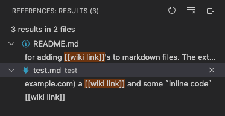
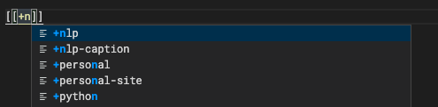
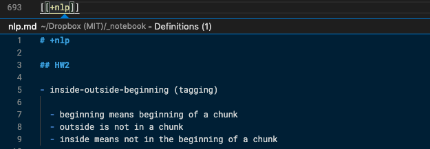

# Linked Notes VSCode

This is a prototype note taking system for vscode. It uses the vscode api to provide a fluid and seamless experiences for adding [[wiki link]]'s to markdown files. The extension provides a references panel, go to definition support, and autocomplete for wiki links. The references panel can be used to see incoming links and references similar to [roam research](http://roamresearch.com/). The go to definition will automatically create a slugged file in the current directory and insert a header containing the text inside the wiki link. For example [[wiki link]] would create a file in the current workspace `wiki-link.md` with the contents `# wiki link`.

I find that this extension enables me to take nested hyperlinked notes, similar to [Andy Matuschak's Note Writing System](https://notes.andymatuschak.org/About_these_notes) with minimal effort. Creating a new note is as simple as `[[new note]]` and go to definition. Back links pop up quickly and effortlessly due to the wiki link autocompletion.

These APIs are made more powerful through the use of some custom settings (inspired by [Andrew Kortina's blog post](https://kortina.nyc/essays/suping-up-vs-code-as-a-markdown-notebook/)).

## Workspace Settings

These are my workspace settings which provide a seamless save experience.

```jsonc
{
  // save files after a delay automatically
  "files.autoSave": "afterDelay",
  "files.autoSaveDelay": 1000,
  // sort the explorer by modified date in descending order
  "explorer.sortOrder": "modified",
  // open files as tabs
  "workbench.editor.enablePreview": false,
  // reveal existing files if they are open (avoids tons of tabs)
  "workbench.editor.revealIfOpen": true,
  // open files from quick open as tabs
  "workbench.editor.enablePreviewFromQuickOpen": false
}
```

## VSCode Vim Settings

I also use the following vim key bindings which provide the illusion of transcluded documents, back links, and linked notes.

```jsonc
  "vim.normalModeKeyBindingsNonRecursive": [
    // open references panel with gr
    {
      "before": ["g", "r"],
      "commands": ["references-view.find"]
    },
    // peek references inline with gR
    {
      "before": ["g", "R"],
      "commands": ["editor.action.referenceSearch.trigger"]
    },
    // open definition in new editor group with gs
    {
      "before": ["g", "s"],
      "commands": ["editor.action.revealDefinitionAside"]
    },
    {
      // peek definition inline with gD
      "before": ["g", "D"],
      "commands": ["editor.action.peekDefinition"]
    },
    // open link with gx
    {
      "before": ["g", "x"],
      "commands": ["editor.action.openLink"]
    }
  ],
```

## Screenshots

The references panel.



Autocomplete for wiki links.



Peek definition and go to definition.



## Development and Release

To create a new release,

```sh
npm install
vsce package
vsce publish
```

To install the `vsix` locally:

1. Select Extensions `(Ctrl + Shift + X)`
2. Open `More Action` menu (ellipsis on the top) and click `Install from VSIX…`
3. Locate VSIX file and select.
4. Reload VSCode.

## Credit

This extension was largely inspired by Andrew Kortina's [blog post](https://kortina.nyc/essays/suping-up-vs-code-as-a-markdown-notebook/) about using vscode to take markdown notes and the related extension [vscode markdown notes](https://github.com/kortina/vscode-markdown-notes). The work flow I adopted was inspired by Jeff Huang's [productivity text file](https://jeffhuang.com/productivity_text_file/) and Andy Matuschak's [working notes](https://notes.andymatuschak.org/About_these_notes).
